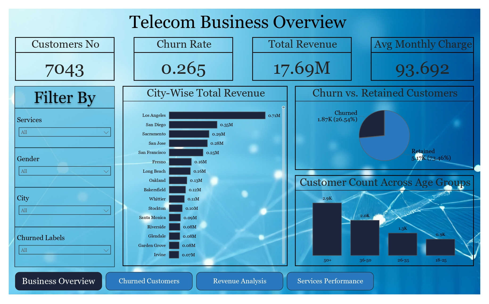
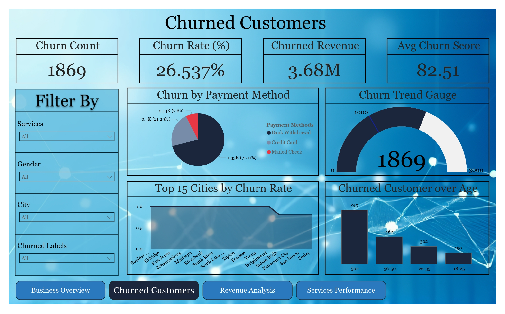
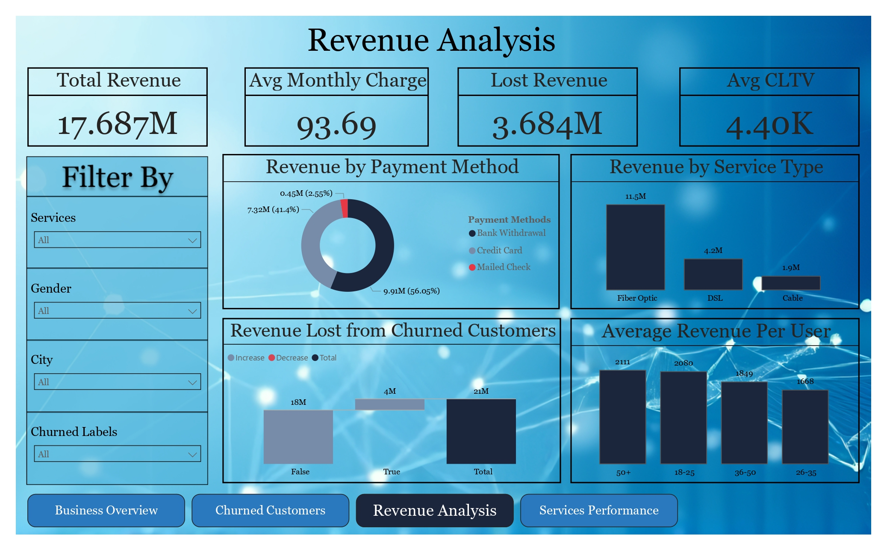
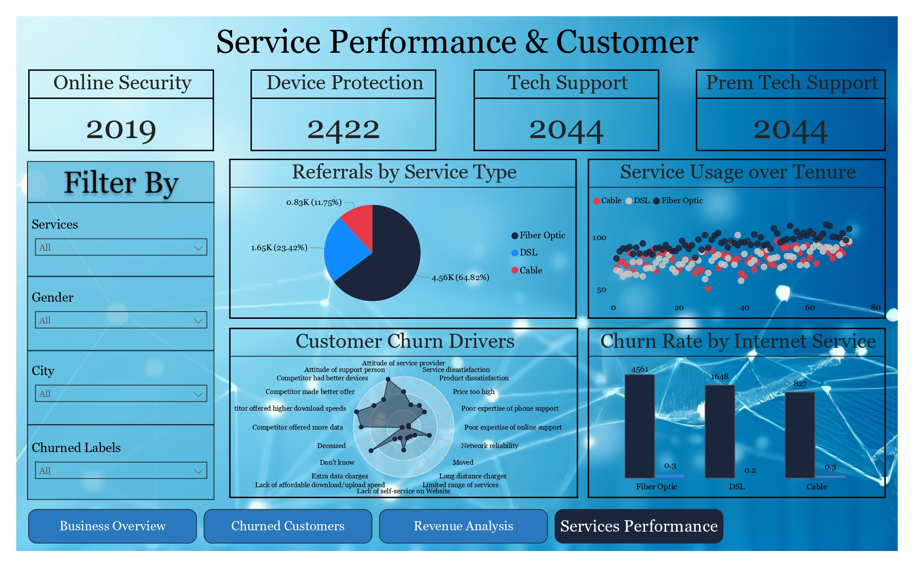

# 📊 Telecom Business Performance Dashboard  

## 🧠 Overview  
This project presents a **Telecom Business Performance Dashboard** built to analyze customer churn, total revenue, and service performance using multiple data sources.  
The goal is to help telecom companies identify high-value customers, understand churn patterns, and optimize service strategies through data-driven insights.  

---

## 🚀 Key Insights  
- **Los Angeles** generated the highest total revenue (**705.6K**), contributing **3.99%** of total revenue — **1.8M% higher** than *Sausalito* (**38.78**).  
- **Bank Withdrawal** customers showed the highest churn count (**1,329**), representing **71.11%** of churned users and **56.05%** of total revenue (**9.91M**).  
- **Fiber Optic** services generated the highest revenue (**11.53M**), **500% higher** than *Cable (1.92M)* and above *DSL (4.23M)*.  
- **Fiber Optic** users also had the highest referrals (**4,561**) and churn rate — showing a strong correlation between adoption and churn.  

---

## 🧩 Project Workflow  

| Phase | Description | Tools Used |
|-------|--------------|------------|
| **1. Data Collection** | Gathered raw telecom data from Excel files. | Excel |
| **2. Data Cleaning** | Removed inconsistencies, handled null values, and standardized formats. | Python (Pandas, NumPy) |
| **3. Data Modeling & ERD** | Designed relational models and built SQL queries for analysis. | SQL |
| **4. Data Analysis & Dashboarding** | Created interactive reports and visuals to explore KPIs. | Power BI |

---

## 📈 Dashboard Features  
✅ **Business Overview:** Customer count, churn rate, total revenue, and average monthly charge.  
✅ **Churned Customers:** Churn distribution by payment method, service type, and city.  
✅ **Revenue Analysis:** Revenue breakdown by payment method and service type, along with lost revenue due to churn.  
✅ **Service Performance:** Customer churn drivers, service usage over tenure, and churn by internet service.  

---

## 🛠️ Tools & Technologies  
- **Power BI** – Dashboard design and visualization  
- **Python** – Data cleaning and preprocessing  
- **Excel** – Data collection and organization  
- **SQL** – Data modeling and query design  

---

## 📚 Skills Demonstrated  
- Data Modeling & ERD Design  
- ETL (Extract, Transform, Load) Workflow  
- KPI Calculation using DAX  
- Interactive Dashboard Creation  
- Churn and Revenue Analysis  

---

## 📸 Dashboard Preview  

  
  

  
  

---

## 🧾 Author  
**Khalid Mohammed Abdelrazk Ibrahim**  
- 📧 Email: [khalidabdelrazk4@gmail.com](mailto:khalidabdelrazk4@gmail.com)  
- 💼 LinkedIn: [Khalid Abdelrazk](https://www.linkedin.com/in/khalid-abdelrazk-7719b32b3/)  
- 🐙 GitHub: [khalidabdelrazk](https://github.com/khalidabdelrazek)
